**Use Case Documentation**

**\
Author: SEMTECH**

# What is this document 

## Script for video recording

The original Integration Guide is a public document, currently reviewed
version is
[<u>here</u>](https://docs.google.com/document/d/1XxAjVtm63l_RglzmtXd3ci9EQpTUKWdE/edit?usp=sharing&ouid=113985381982922097226&rtpof=true&sd=true)

We also need a video recording, which essentially illustrates the
content of this guide. Hence we will:

1)  Split the guide into senses of 20-60sec each

2)  Add narration

3)  Generate callouts

4)  Review chapters / titles / structure

5)  Generate pause markers

After this, we will feed the document and other into an AI tool that
generates the video.

# 

# FRAME STORY:

#### Scene 1:

Palo ALto NEtworks ⇒ Security

Semtech ⇒ Connectivity

Joint solution: Secure connectivity for utility providers.

#### Scene 2:

## Integration Benefits

- End-to-end, context-aware security with local link protection,
  encrypted transport, application visibility, and threat prevention.

- Automated onboarding, configuration, fleet monitoring, and
  over-the-air (OTA) updates across thousands of devices.

- Unified visibility, logging, and policy enforcement across edge and
  firewall deployments.

- Open standards, no vendor lock-in—IPsec, EST, and REST APIs integrate
  easily with existing security infrastructure.

- Seamless public key infrastructure (PKI) and certificate lifecycle
  management (CLM) automate certificate provisioning and renewal,
  strengthening IPsec auth and preventing expiry outages.

#### Scene 3:

## Integration Diagram

> 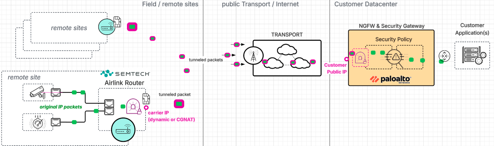 style="width:7.66667in;height:2.26389in" />

# 

# PRODUCTS USED

**ZT-PKI for EST Enrollment**

To set up EST enrollment in an Airlink Router, following data is needed

- EST Enrollment URL (e.g.
  [<u>https://ztpoki.venafi.com</u>](https://ztpoki.venafi.com))

- EST Policy Label (a hash-type string that defines under which policy
  in the ZT-PKI a request must be handled and against which it will be
  authenticated)

- EST API key and API Key ID (as credentials for the EST request in the
  ZT-PKI)

**IPSec shared information**

To set up IPSec on both sides PanOS and Airlink, following information
must match on both sides:

- Local Networks on each side:

  - The Airlink local Network that will be routed through the IPSec
    tunnel, and that is used by the devices wired to the Airlink. It is
    required to provide one unique network for each Airlink, or to cater
    via separate logical routers on the NGFW side for overlapping IP
    ranges. Within the IPSec tunnels belonging to one Logical Router or
    VRF, the IP network behind an Airlink must be unique.

  - The NGFW network(s) in the customer datacenter. Traffic from those
    network(s) is routed back into the IPSec tunnels if the Airlink
    local networks are destination

<!-- -->

- Certificate certified Identities:

> When the certificates are issued, the subjects need to add a “Subject
> Alternate Name” (SAN) into the Certification Request. This name does
> NOT need to be a registered DNS name or resolvable, it can be any name
> that the peers present to each other to mutually identify. In PanOS,
> the NGFW identifies the IKE GW to use for the connection/tunnel by
> searching this SAN in its list of available IKE Gateways.

- The Airlink SAN DNS:\[airlink serial number\] becomes the IPSec
  localID on the airlink and the IPSec remoteID on the NGFW

- The NGFW SAN DNS:\[e.g. FW hostname or serial\] becomes the IPSec
  localID on the NGFW and the IPSec remoteID on the Airlink routers

# Before You Begin

Make sure you have the following available:

- Access to the local configuration interface of the Airlink Router.
  This can be either via ALMS or from local login.

- Access to the NGFW PanOS GUI

- Access to the ZT-PKI GUI to fetch API keys, CA labels and to manually
  enroll NGFW Certificates

- Planning Data: Airlink local network(s) at least 1 per Airlink, NGFW
  Datacenter Network, and the EST enrollment data for the Airlinks.

To be able to get a fully functioning IPSec tunnel and test it, you need
one local device to connect to the Airlink router (e.g. a PC/Laptop)

To be able to enroll for EST or manual certificates, you must know which
CA Policy and organisation/account is assigned to your project! You can
not define anything in the PKI policies, but need to go to the right
place to find your settings! This has proven to be a confusing step -
make sure you know where to go before you start !

**Note, that issued certificates are “sensitive”**: Per se a certificate
is public information and not needed to be kept secure (only the private
key). But when you issue a certificate on an existing customer account
in the PKI, it means that you generated a key that can access the
customer's network now, because they trust that CA! Hence account
discretion is important and you must not issue certificates without
permission of the CA owner!

## Overall Workflow

Note that the "Integration" materialises as a certificate-authenticated
IPSec tunnel. Hence it is configured in a triangle on 3 platforms:

1)  Certificate preparation in the ZT-PKI

2)  IPSec client side configuration on the Airlink router

3)  IPSec passive/server side configuration in the NGFW

For your orientation in the process, follow this order of steps

<table style="width:100%;">
<colgroup>
<col style="width: 4%" />
<col style="width: 28%" />
<col style="width: 8%" />
<col style="width: 45%" />
<col style="width: 13%" />
</colgroup>
<tbody>
<tr>
<td style="text-align: center;"><strong>#</strong></td>
<td style="text-align: left;"><strong>Step</strong></td>
<td style="text-align: center;">
<strong>Execute</strong>

<strong>on</strong>
</td>
<td style="text-align: left;"><strong>Description</strong></td>
<td style="text-align: left;">
<strong>Chapter</strong>

<strong>reference</strong>
</td>
</tr>
<tr>
<td style="text-align: center;">1</td>
<td style="text-align: left;">Verify CA Label</td>
<td style="text-align: left;">ZT-PKI</td>
<td style="text-align: left;">Fetch different parameters you need during
the process from the PKI, save in a txt file until you're done.</td>
<td style="text-align: left;"><a href="#step-1-verify-ca-label"><u>Step
1 link</u></a></td>
</tr>
<tr>
<td style="text-align: center;">2</td>
<td style="text-align: left;">Generate API Key</td>
<td style="text-align: left;">ZT-PKI</td>
<td style="text-align: left;">Keep that along with the other parameters
from the previous step, to later define EST credentials</td>
<td style="text-align: left;"><a href="#step-2-generate-api-key"><u>Step
2 link</u></a></td>
</tr>
<tr>
<td style="text-align: center;">3</td>
<td style="text-align: left;">Download EST CA Certificates</td>
<td style="text-align: left;">ZT-PKI</td>
<td style="text-align: left;">Need to copy those later to Airlinks (all)
and NGFW</td>
<td style="text-align: left;"><a
href="#step-3-download-est-ca-certificate"><u>Step 3 link</u></a></td>
</tr>
<tr>
<td style="text-align: center;">4</td>
<td style="text-align: left;">Fetch TLS CA Certificates</td>
<td style="text-align: left;">web</td>
<td style="text-align: left;">Need to copy this later to Airlinks
(all)</td>
<td style="text-align: left;"><a
href="#step-4-fetch-tls-ca-certificates"><u>Step 4 link</u></a></td>
</tr>
<tr>
<td style="text-align: center;">5</td>
<td style="text-align: left;">Generate NGFW Certificate Profile</td>
<td style="text-align: center;">NGFW</td>
<td style="text-align: left;">To ensure that EST certificates can be
verified</td>
<td style="text-align: left;"><a
href="#step-5-generate-a-ngfw-certificate-profile"><u>Step 5
link</u></a></td>
</tr>
<tr>
<td style="text-align: center;">6</td>
<td style="text-align: left;">Generate NGFW CSR</td>
<td style="text-align: center;">NGFW</td>
<td style="text-align: left;">NGFW does not have an EST client or
Certificate Management Protocol that we can use with ZT-PKI.</td>
<td style="text-align: left;"><a
href="#step-6-generate-a-csr-in-the-ngfw"><u>Step 6 link</u></a></td>
</tr>
<tr>
<td style="text-align: center;">7</td>
<td style="text-align: left;">Issue NGFW Certificate</td>
<td style="text-align: center;">ZT-PKI</td>
<td style="text-align: left;">For NGFW to authenticate towards Airlinks
(all)</td>
<td style="text-align: left;"><a
href="#step-7-manually-issue-a-certificate-by-csr"><u>Step 7
link</u></a></td>
</tr>
<tr>
<td style="text-align: center;">8</td>
<td style="text-align: left;">Import NGFW Certificate</td>
<td style="text-align: center;">NGFW</td>
<td style="text-align: left;">For NGFW to authenticate towards Airlinks
(all)</td>
<td style="text-align: left;"><a
href="#step-8-import-the-ngfw-certificate"><u>Step 8 link</u></a></td>
</tr>
<tr>
<td style="text-align: center;">9</td>
<td style="text-align: left;">Upload CA-Certs to Airlink</td>
<td style="text-align: center;">Airlink</td>
<td style="text-align: left;">To ensure that EST certificates can be
verified</td>
<td style="text-align: left;"><a
href="#step-9-upload-ca-certs-to-airlink"><u>Step 9 link</u></a></td>
</tr>
<tr>
<td style="text-align: center;">10</td>
<td style="text-align: left;">Configure Airlink EST Credentials</td>
<td style="text-align: center;">Airlink</td>
<td style="text-align: left;">Use API key for EST enrollment
credentials</td>
<td style="text-align: left;"><a
href="#step-10-configure-airlink-est-credentials"><u>Step 10
ink</u></a></td>
</tr>
<tr>
<td style="text-align: center;">11</td>
<td style="text-align: left;">Configure Airlink CSR</td>
<td style="text-align: center;">Airlink</td>
<td style="text-align: left;">Define how Airlink EST CSR will look
like</td>
<td style="text-align: left;"><a
href="#step-11-configure-airlink-csr"><u>Step 11 link</u></a></td>
</tr>
<tr>
<td style="text-align: center;">12</td>
<td style="text-align: left;">Configure Airlink local Networks</td>
<td style="text-align: center;">Airlink</td>
<td style="text-align: left;">Define the networks that go through the
IPSec tunnel</td>
<td style="text-align: left;"><a
href="#step-12-configure-airlink-local-networks"><u>Step 12
link</u></a></td>
</tr>
<tr>
<td style="text-align: center;">13</td>
<td style="text-align: left;">Configure Airlink IPSec</td>
<td style="text-align: center;">Airlink</td>
<td style="text-align: left;">Configure IPsec client crypto and local
params</td>
<td style="text-align: left;"><a
href="#step-13-configure-airlink-ipsec"><u>Step 13 link</u></a></td>
</tr>
<tr>
<td style="text-align: center;">14</td>
<td style="text-align: left;">TEST BEFORE CONTINUING</td>
<td style="text-align: center;">NGFW</td>
<td style="text-align: left;">Check if IKE requests from Airlink are
arriving</td>
<td style="text-align: left;"><a
href="#step-14-look-for-ike-connectivity-attempts-from-the-airlink"><u>Step
14 link</u></a></td>
</tr>
<tr>
<td style="text-align: center;">15</td>
<td style="text-align: left;">Verify Crypto Profiles</td>
<td style="text-align: center;">NGFW</td>
<td style="text-align: left;">Crypto settings for IKE and IPSec match on
both sides</td>
<td style="text-align: left;"><a
href="#step-15-verify-crypto-profiles"><u>Step 15 link</u></a></td>
</tr>
<tr>
<td style="text-align: center;">16</td>
<td style="text-align: left;">Configure IKE GW</td>
<td style="text-align: center;">NGFW</td>
<td style="text-align: left;">Define Airlink IKE negotiation
parameters</td>
<td style="text-align: left;"><a
href="#step-16-configure-ike-gw"><u>Step 16 link</u></a></td>
</tr>
<tr>
<td style="text-align: center;">17</td>
<td style="text-align: left;">Define Tunnel Interface</td>
<td style="text-align: center;">NGFW</td>
<td style="text-align: left;">L3NIC for decapsulation and LR/VRF
assignment</td>
<td style="text-align: left;"><a
href="#step-17-define-tunnel-interface"><u>Step 17 link</u></a></td>
</tr>
<tr>
<td style="text-align: center;">18</td>
<td style="text-align: left;">Configure IPSec Tunnel</td>
<td style="text-align: center;">NGFW</td>
<td style="text-align: left;">L3 tunnel Object and local/remote network
selectors</td>
<td style="text-align: left;"><a
href="#step-18-configure-ipsec-tunnel"><u>Step 18 link</u></a></td>
</tr>
<tr>
<td style="text-align: center;">19</td>
<td style="text-align: left;">Add static Routes</td>
<td style="text-align: center;">NGFW</td>
<td style="text-align: left;">This might be customer specific, we
propose a 2 LR setup that has been tested and can be extended easy</td>
<td style="text-align: left;"><a
href="#step-19-add-static-routes"><u>Step 19 link</u></a></td>
</tr>
<tr>
<td style="text-align: center;">20</td>
<td style="text-align: left;">TEST BEFORE CONTINUING</td>
<td style="text-align: center;">NGFW</td>
<td style="text-align: left;">Tunnel should come up and traffic get
through</td>
<td style="text-align: left;"><a
href="#step-20-test-if-ipsec-tunnel-comes-up"><u>Step 20
link</u></a></td>
</tr>
<tr>
<td style="text-align: center;">21</td>
<td style="text-align: left;">Define NGFW Security Policy</td>
<td style="text-align: center;">NGFW</td>
<td style="text-align: left;"></td>
<td style="text-align: left;"><a
href="#step-21-define-ngfw-security-policy"><u>Step 21 link</u></a></td>
</tr>
</tbody>
</table>

## Note about Bulk provisioning

This document describes the BASIC INTEGRATION PROCESS in manual steps.
This is required to understand and test the architecture. Once a
specific setup is verified, you can scale-up the Airlink deployment with
different automations. Available are

- Panorama based: We provide a google sheet that allows you to enter
  Airlink information (serial number and local Airlink network). This
  information is used to create a provisioning file, which contains all
  other parameters (like FW local Cert to use, FW NIC and IP addresses,
  …) as default values. You start a macro in the google-sheet which will
  create a json provisioning file for any number of airlinks, dozens or
  hundreds. With this provisioning file and a python script we provide
  along as well, you can provision the IKE GW, IPSec tunnel and basic
  routing- and Security Policy into Panorama. NOTE: The panorama method
  requires that you have a NGFW connected to Panorama (device Group) and
  that both Panorama and NGFW are in sync!

- XSOAR based: With an optional XSOAR Integration, you can use a warroom
  command or a GUI automation (easy-button) that will read a VPN config
  from an Airlink router and provision the corresponding IKE GW, tunnel
  and security policy rules to an NGFW. This is based on the
  p5g-Integration in XSOAR and the topology files that define the
  relationships between Airlink routers/Edge devices and a Core NGFW
  (see [<u>Reference
  Architecture</u>](https://www.paloaltonetworks.com/resources/guides/sec-on-premises-private-5g-design))

- Airlink Bulk Provisioning: Semtech has the cloud-based Airlink
  Management System, ALMS. (An on-prem variant exists but has not been
  used for our tests yet). Via ALMS it is possible to support
  “Workflows” and 'Templates" ; A Template is a similar construct like
  Templates in Panorama or Snippets in SCMN, it defines a basic
  configuration blueprint that can be deployed on scale. A Workflow is
  comparable to variables in Snippets or Template Stacks, it allows to
  set individual, per-box parameters (like serial-number or local
  network) within a template when applying it to many devices.

# Palo Alto Networks Configuration

Configuring the Palo Alto Products requires steps in 2 different
Platforms;

## [<u>Settings in the ZT-PKI</u>](#steps-to-execute-in-the-zt-pki)

ZT-PKI policies are currently set up by Professional Services. As a user
of the service, you can log in and perform following actions:

- verify settings, such as policy settings or CA-Label (for EST
  enrollment)

- Generate API keys (needed for EST enrollment authentication of the
  Airlink routers)

- list issued Certificates

- manually revoke certificates

The current phase does NOT provide revocation lists or Online Status
Checks (OCSP), nor further integrations like whitelisting of Airlink
serial numbers or similar. Such are CUSTOMER SPECIFIC and will be added
per project. During regular operation, it is normally not required to
log in to the PKI and perform routine tasks, the renewal of Airlink
certificates happens automatically.

NGFW currently has NO AUTOMATED certificate lifecycle management
protocol like EST. It is therefore required to update the NGFW
Certificate manually. We suggest to create an extended lifetime of at
least 1 year. The corresponding private key (identity) will - if
configured as described here - never leave the NGFW TPM. Hence longer
lifetime can be considered secure.

## [<u>Settings in the NGFW</u>](#steps-to-execute-in-the-ngfw)

The NGFW basic IPSec configuration comprises following steps:

- Ensuring basic crypto parameters and re-key timers match on Airlink
  and NGFW

- Define an IKE GW

- Define a tunnel interface and IPSec tunnel

In order to actually use the IPSec tunnel, you will also want to
configure the following:

- Routing between transport-underlay, Service network and tunnels

- Security Policies to define traffic between Airlinks and Service
  networks

\
-

## 

## Steps to execute in the ZT-PKI

This chapter describes settings that are executed in the ZT-PKI. The
actions are general and screenshots are examples. The order of steps is
not chronological on one Platform, see the [<u>overview
table</u>](#overall-workflow)

Login to the ZT-PKI currently requires SSO mapping. If you can not
access, you probably have no CA assigned either! Login URL is

[<u>https://ztpki.venafi.com</u>](https://ztpki.venafi.com)

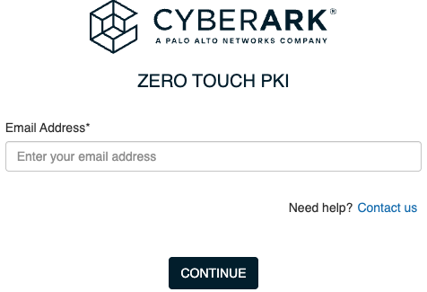

Upon successful login you land on the main dashboard of the ZT-PKI

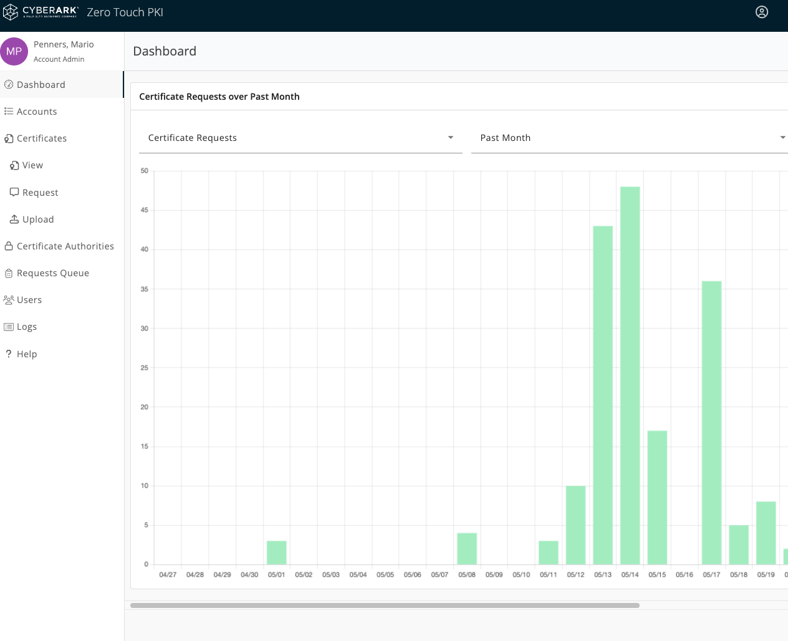

#### Step 1: Verify CA Label

[<u>(back to overview table)</u>](#overall-workflow)

Starting from the main Dashboard, to know your CA-Label, navigate to
“Accounts” in the left side menu and select your account.

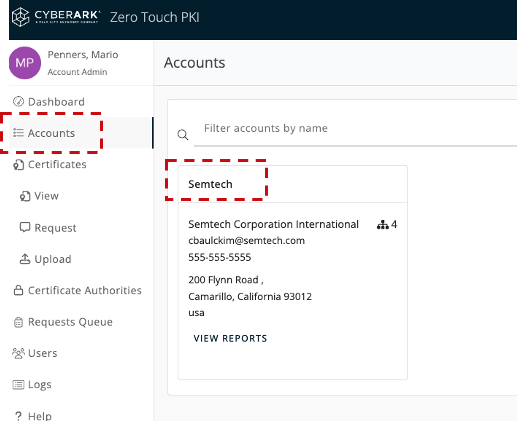

In the account page that opens after selecting your account, scroll down
to the “Policies” section and open it. The lines represent “signing
rules” that your CA checks before signing a request. Such can be e.g.
authentication methods for requests, duration of issued certificates,
usage allowed for a cert like code-signing vs. IPSec tunnels etc ….
**From the below screenshot, take a note of the “Policy ID” for your
CA/Org! This will be used as ‘CA Label” later in the Airlink EST setup.
Also note CA and Org for later reference.**

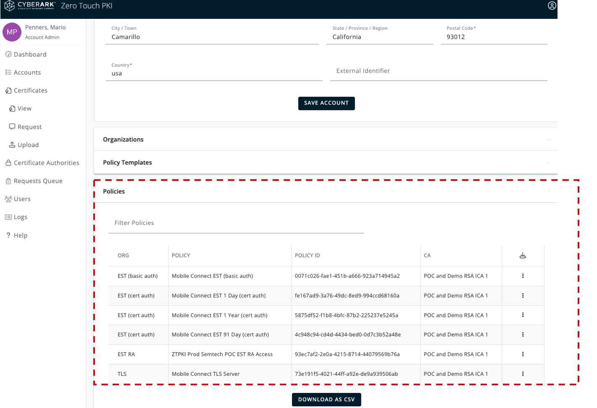

#### 

#### Step 2: Generate APi Key

[<u>(back to overview table)</u>](#overall-workflow)

In all workflows we tested so far, you will need an API key to
authenticate the first enrollment of a new Airlink. To get the key,
navigate from the main Dashboard to Users, select your User Name . In
the page of your account, there is a button “Add API Key”

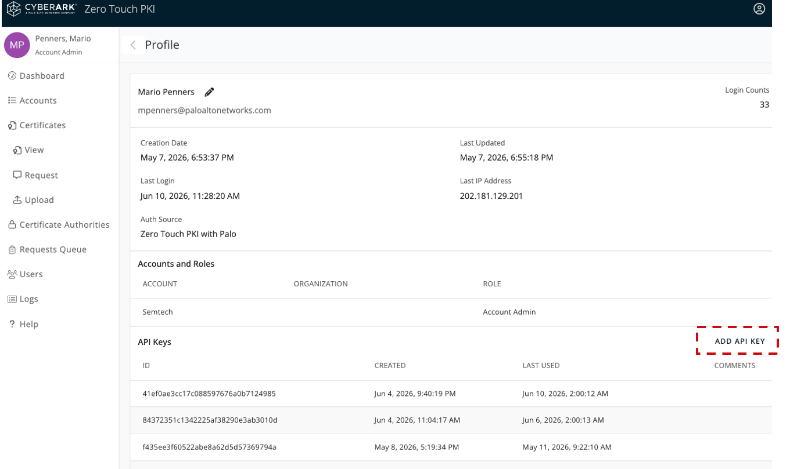

When you press the button, the key is immediately displayed AND added to
the list of available keys. You will NOT be able to see that key again,
copy it immediately along with the key ID. The 3 dots on the right side
of each key later allow some basic key management like adding comments
(where are you going to use that key or to whom you will give it, and
“rolling", i.e. revoke old and generate new)

#### Step 3: Download EST CA Certificate

[<u>(back to overview table)</u>](#overall-workflow)

To verify any certificate, including “your own", you need the CA
certificate of the signing CA, and of the CA that signed the signing CA
(and any intermediates between your signing CA and the initial
self-signed root-CA as well!) Our chains usually have a signing CA and a
root CA, so it's 2 CA certs plus one leaf cert to identify a node (aka
leaf)

The CA certificates belonging to your signing key are - from the main
dashboard - under "Certificate Autjorities”; you should find the CA that
matches your policy ID from Step 1 (rightmost column beside the policy
ID) , select THAT CA if there are more than one. Inside the CA screen,
you have a Download button in the upper right corner.

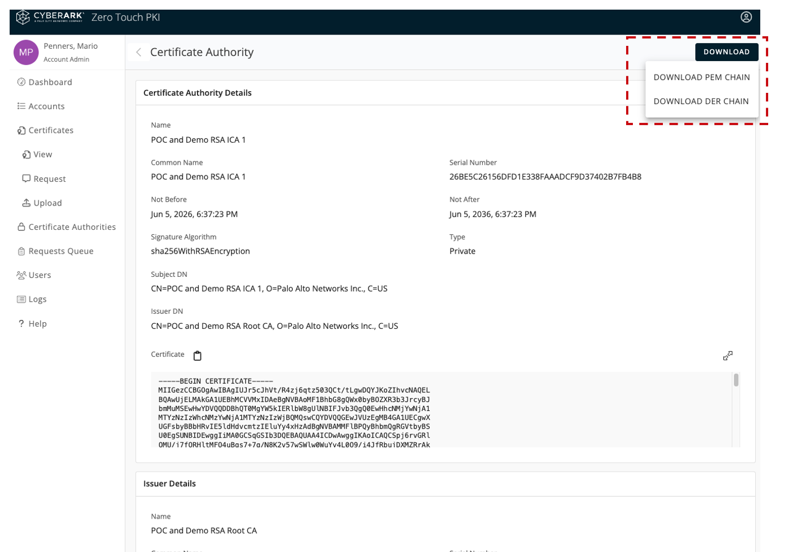

PEM formatted certificates are easier to handle and troubleshoot, they
are base64 encoded ASCII blocks between —--CERTIFICATE—-- tags. DER
formatted certificates are ASN.1 binary, its more difficult to look into
the file and you can not simply “take out one piece of a chain” and use
it alone, in PEM you can do that. **Download the PEM Chain.**

#### Step 4: Fetch TLS CA Certificates

[<u>(back to overview table)</u>](#overall-workflow)

EST (Enrollment over Secure Transport) is the certificate lifecycle
management protocol that is used to fetch new certificates and to renew
them. When an EST client like an Airlink is contacting a ZT-PKI to fetch
a certificate, it is important that it is connecting to the CORRECT
ZT-PKI and not some rogue system. Also, the transport protocol should be
encrypted - TLS in case of EST.

Airlink routers do not have a “Trust store” like web-browsers have or a
set if trusted CAs is preinstalled like with linux distributions. In
order to contact the ZT-PKI via TLS and authenticate the ZT-PKI server
during the TLS handshake, we need to manually add a trusted CA to the
Airlink.

NOTE that this CA is different from the CA-certificates that belong to
the keys signing the Airlink or NGFW leaf certificates! We do not
have/own any keys for this commercial 3rd party CA!

**Navigate to: <https://www.identrust.com/support/downloads> and find
the following CA certs:**

**“IdenTrust Commercial Root CA 1” and “Hydrant Server CA1**

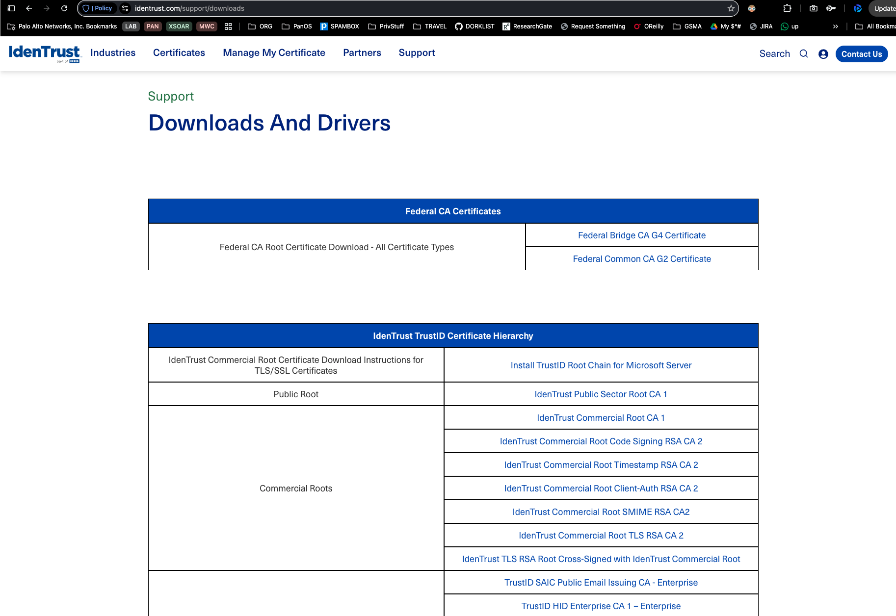

Those are currently used by the
[<u>ztpki.venafi.com</u>](http://ztpki.venafi.com) service (i.e.
presented during EST TLS handshake)

The certificates come as p7b (PKCS#7) envelope, its a file format that
usually contains certificate chains without private keys. They can be
either format PEM (then you can open it in a text editor) or binary
(then you get terminal garble/no open) See the Troubleshooting section
if you run into problems when later using the downloaded certificates.

#### Step 7: Manually issue A Certificate by CSR

[<u>(back to overview table)</u>](#overall-workflow)

When working on the NGFW, you will generate a key-pair and have the
public key signed by the ZT-PKI. Since the NGFW does currently not have
an EST client or other supported certificate Lifecycle Management
protocol, we do this manually.

Follow the instructions in Steps 5 and 6 on the NGFW, then you come back
to the ZT-PKI with your PEM formatted Certificate Signing request from
the NGFW (CSR)

**In the ZT-PKI, navigate from the main Dashboard to “Request”. Select
the “Org” and “CA” that are defined for your policy ID in Step 1. Then
you will be able to paste in your CSR and parse it**

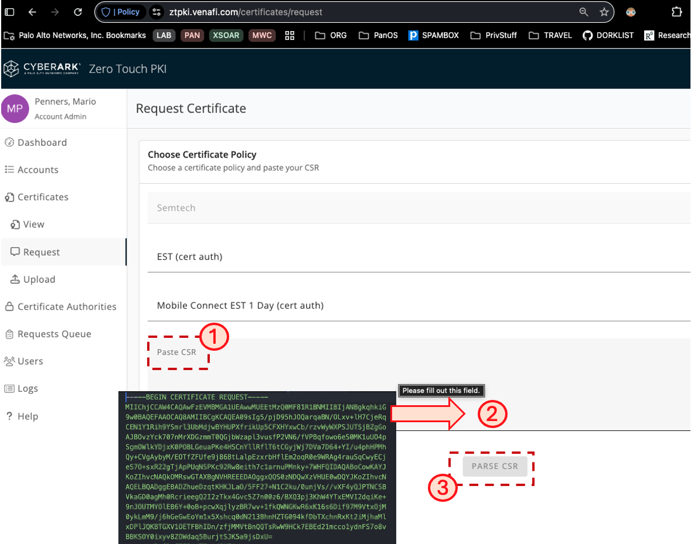

When the request is parsed you will be able to issue the certificate.
Download the PEM format without chain. You can do this with any CSR
(e.g. such created manually with openssl command in linux) If your CSR
was generated in the NGFW, you can import the certificate and it should
be matched with the open CSR that holds the private key (which did not
leave the NGFW during this signing process!)

## Steps to execute in the NGFW

This chapter describes settings that are executed in the NGFW.. The
actions are general and screenshots are examples. The order of steps is
not chronological on one Platform, see the [<u>overview
table</u>](#overall-workflow)

Log in to the NGFW GUI as described
[<u>here</u>](https://docs.paloaltonetworks.com/ngfw/getting-started/initial-setup-configuration-ngfws),
make sure you have a basic networking setup (out of scope of this
document)

#### Step 5: Generate a NGFW Certificate Profile

[<u>(back to overview table)</u>](#overall-workflow)

In order to be able to verify certificates that are issued via EST CA,
we need to create a Certificate Profile that includes the EST CA chain.

In case you are using Panorama (bulk provisioning), the Certificate
Profile must be generated into the template, leave the ‘shared” box
active. The Certificate Profile in regular PanOS is found under **Device
-\> Certificate management -\> Certificate Profile , create a new
profile by adding the EST CA Certificate Chain you downloaded in Step
3.**

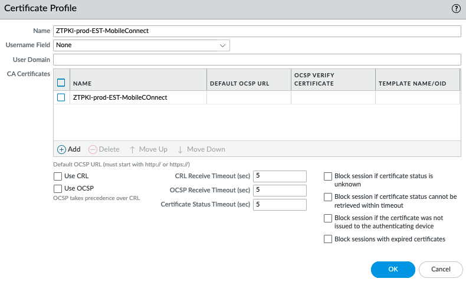

For maximum compatibility and ease of deployment, we have not checked
any restrictions in the profile. For production purpose, restrictions or
use of a CRL might be required!

#### Step 6: Generate a CSR in the NGFW

[<u>(back to overview table)</u>](#overall-workflow)

The process to obtain a Certificate from an external CA is found in the
tech docs
[<u>here</u>](https://docs.paloaltonetworks.com/ngfw/administration/certificate-management/obtain-certificates/obtain-certificate-from-external-ca),
it comprises 3 actions:

Action 1: Create CSR in the NGFW (here in this Step 6)

Action 2: go to ZT-PKI and get the CSR signed (described in Step 7)

Action 3: come back here and upload signed certificate (Step 8)

**Action 1: Create a CSR in the NGFW**

Navigate to **Device -\> Certificate Management -\> Certificate**s ,
press the “**Generate**” button in the bottom trim of the PanOS GUI)

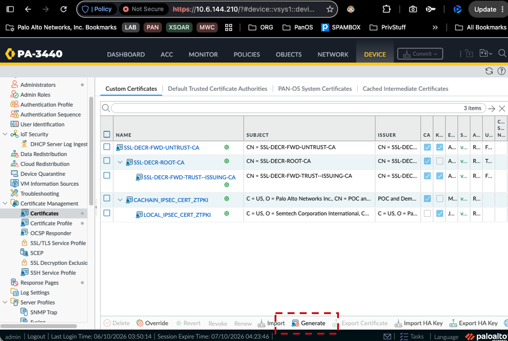

Fill the CSR as in the example below: Your “Subject Name” will be the
certificates main identity. The SAN field on the bottom is key for
IPSec, it defines what will later be the locaID (on PanOS side) or
remoteID (on Airlink side) for the IPsec tunnel. This does not need to
be resolved in DNS but it needs to match exactly and case sensitive to
the IKE settings later.

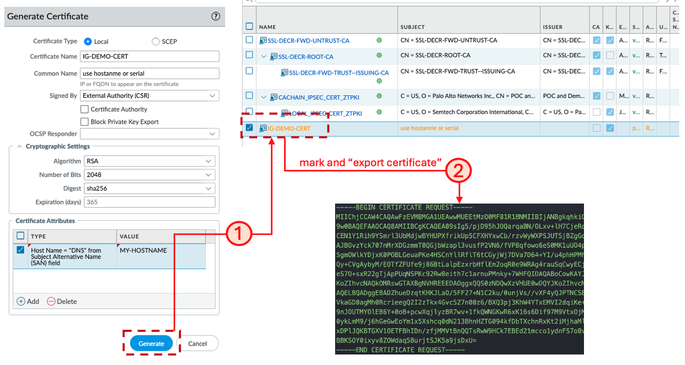

**Action 2: Get the CSR signed (Step 7)**

Once the CSR is created you see an orange colored certificate in the GUI
that is “pending”, i.e. not yet a real certificate, but a CSR you just
created. Exporting this file will create a PEM encoded request in your
browsers downloads. Open that in an editor for the Step 7 / next action
and get the CSR signed!

#### \

#### Step 8: Import the NGFW Certificate

[<u>(back to overview table)</u>](#overall-workflow)

After you have downloaded the Certificate (i.e. the parsed and signed
CSR) in Step 7 from the ZT-PKI, you continue here with Action 3 and
import it back into the NGFW. Press the “Import” button on the GUI
bottom trim, use EXACTLY THE SAME certificate name than you have in the
request, then browse to the PEM file (without chain) that you downloaded
from the ZT-PKI after the CSR was signed.

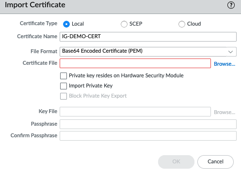

The previously orange CSR will now have turned blue and provide a real
certificate, it will also be shown in the chain with the CA certificates
that you installed in Step 5! If this is not the case and it looks
different, you have to solve this first and IPSec will not work unless
the NGFW recognises the certificate and chain properly! A working
example:

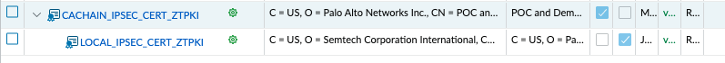

#### \

#### 

#### Step 14: Look for IKE Connectivity Attempts from the Airlink

[<u>(back to overview table)</u>](#overall-workflow)

Up to Step 8, you have prepared the NGFW to authenticate an Airlink
router using EST Certificates, but you have in Step 8 not defined any
IPSec or IKE settings in the NGFW. During Steps 9-12, you will prepare
the Airlink routers to initiate the IPSec connection! After completing
Step 12, you should execute this test to see if it makes sense to
continue with the NGFW IKE and IPsec configuration, or if you have a
connectivity issue!

**Verify in the NGFW that you receive ike traffic on the expected
Interface and from an expected address:** Once you open a public IP for
IPSec access, you will immediately receive scans and traffic from
unknown IPs. Check if the one you expect from your Airlink router is
among it. If you don't know your Airlinks public IP, connect a computer
to it and try “curl [<u>ifconfig.me</u>](http://ifconfig.me)” or
“[<u>www.whatsmyip.com</u>](http://www.whatsmyip.com)”

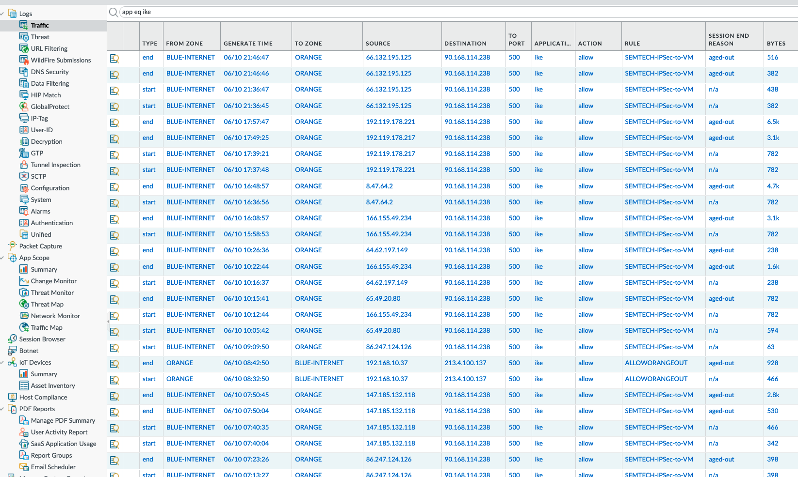

#### Step 15: Verify Crypto Profiles

[<u>(back to overview table)</u>](#overall-workflow)

Some values of the Airlink default crypto settings deviate from the
PanOS default values. To adapt we change the profiles in PanOS rather
than keeping changing it in every single Airlink. Note, that for the
Automations / bulk deployment, we have to define the name of the default
crypto parameter sets in the NGFW.

**Action 1:** Create your IKE crypto Profile, click in the PanOS GUI to
“Network” -\> “Network Profiles” -\> “IKE Crypto”

In the low trim of the window, click “Add”, create a profile that must
be exactly called “semtech_defaults” as follows

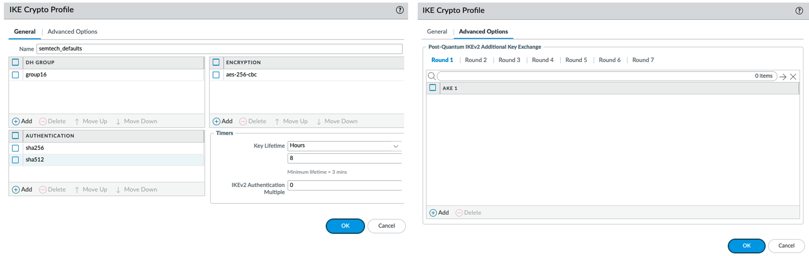

**Action 2:** Create your IPSec crypto Profile, click in the PanOS GUI
to “Network” -\> “Network Profiles” -\> “IPSec Crypto”

In the low trim of the window, click “Add”, create a profile that must
be exactly called “semtech_defaults” as follows

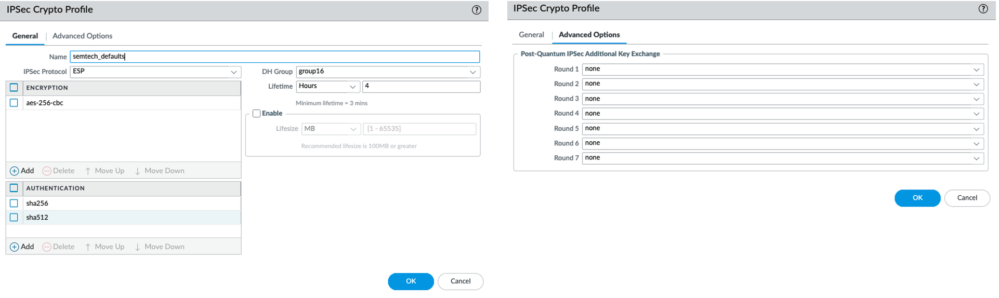

Note, it is important to set the timers as shown in the profiles, here
and in Step 13! Per default, the IPsec tunnels die after a couple of
hours because the re-key timings don't match unless adjusted as here!
Since the NGFW is fully in passive mode, it could expire keys befoe the
Airlink initiates a re-negotiation.

#### Step 16: Configure IKE GW

[<u>(back to overview table)</u>](#overall-workflow)

This is the central piece of the NGFW configuration, to authenticate the
Airlink by Certificate and to allow tunnel creation. We need one IKE GW
per one Airlink router, and one IPSec tunnel later per each IKE GW. In
production you may encounter setups with hundreds or thousands of
Airlinks, therefore you need a naming convention that maps unambiguously
between the Airlink, the certificate, the IKE GW and the IPSec tunnel.

Our existing automations expect the IKE and IPSec objects to be named by
the serial number of the Airlink, which is also carried in the
Certificate, e.g. following is a view to automation-created IKE Gateways
under **“Network” -\> “Network Profiles” -\> “IKE Gateways”**

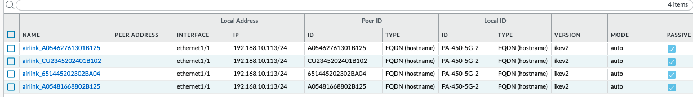

Set the IKE parameters as follows

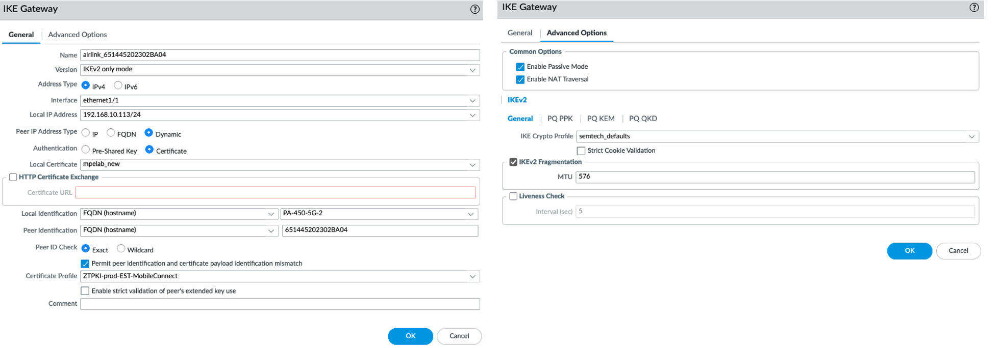

Regarding the above example, following additional comments:

- Interface ethernet1/1 is the NIC exposed to public Internet (from
  where the Airlink traffic arrives) and IKE/IPSec traffic

- The IP address in the PanOS GUI can only be chosen from available IPs
  on the NIC. In this example, the IPSec traffic passes NAT before it
  hits the IPSec GE (i.e.
  [<u>mpelab.duckdns.org</u>](http://mpelab.duckdns.org) that was
  defined in the Airlink Step 13 is sitting in front of this specific
  ethernet1/1 and NATing traffic inbound) In your example, this could
  also be directly a public IP or anything where the Airlink IKE traffic
  hits.

- Peer IP Address type “Dynamic” means that the Airlink IP address is
  not relevant, and that we can only act in Passive mode (which is set
  under IKE Advanced Options)

- The local Certificate is the file you imported in Step 8 into the
  NGFW, the Certificate Profile is the corresponding CA chain

#### Step 17: Define Tunnel Interface 

[<u>(back to overview table)</u>](#overall-workflow)

The tunnel Interface is the actual termination point for the IPSec
tunnel. We propose to create 2 Logical Routers within the default VRF:
An Underlay for ethernet1/1 from the previous step, this is where the
traffic enters the NGFW. ANd a separate Logical Router for services in
the Datacenter. This allows for clean segmentation on the IP layer:

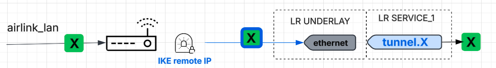

- Underlay traffic can come from different TelCo providers or networks
  and might even expose overlapping IP ranges if multiple private
  networks are involved. Keeping LR UNDERLAY separate completely
  separates the transport from the actual application traffic

- Application traffic gets decapsulated (i.e. separated from the
  UNDERLAY IP headers) in tunnel.X.. Placing the tunnel interface in a
  LR separate from UNDERLAY allows additionally overlapping IP addresses
  in the Airlink LANs. For such cases, each overlap can be kept inside
  an own SERVICE_x LR.

Besides terminating the IPSec tunnel, the tunnel.X interface has the
following functions

- Get assigned to the security Zone to which the Airlinks application
  traffic will belong.

- Hold and DPD IP addresses, if you want to configure DPD (not done in
  current solution phase)

- Hold any addresses for dynamic exchange via routing protocols in case
  used (not done in current solution phase)

- Hold MTU and MSS settings to ensure the end-to-end connectivity
  between Service hosts and Airlink is working without re-sending or
  fragmentation issues.

Go to **“Network” -\> “Interfaces” -\> “Tunnel”** and define for each
Airlink one tunnel interface

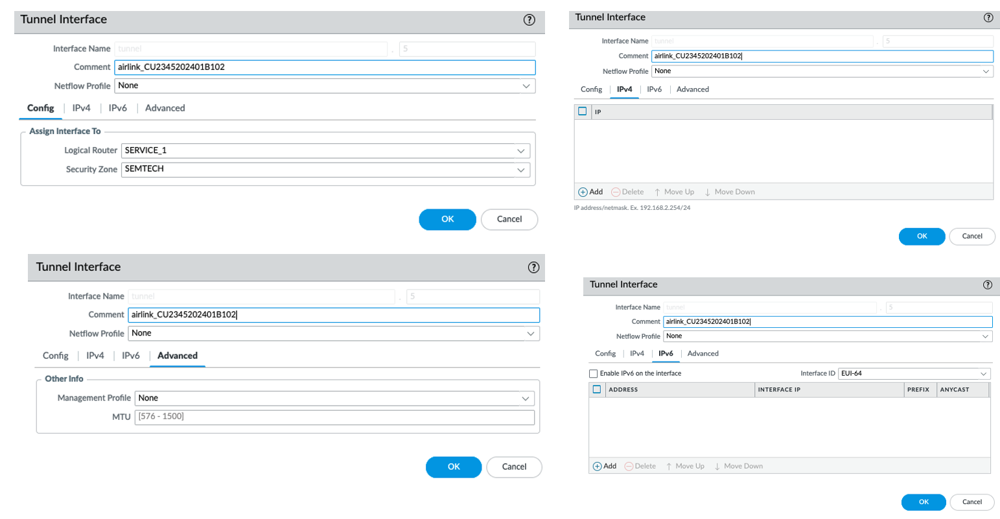

#### Step 18: Configure IPSec Tunnel 

[<u>(back to overview table)</u>](#overall-workflow)

IPSec tunnel objects map the tunnel.X interface from Step 17 with the
so-called “proxy selectors”, which are in fact just local and remote
networks we defined already on the Airlink as local- and remote
networks. From NGFW point of view we have:

- Local selectors, the Service_1 LR and all IP networks in it. We tested
  with one aggregated /24 network

- Remote selectors, we assume one local /24 on each Airlink. Local
  Airlink network segments must be unique or overlsaps be taken care for
  e.g. by creating additional service LRs.

Go to **“Network” -\> “IPSec Tunnels”** and add a new tunnel for each
Airlink:

#### Step 19: Add static routes

[<u>(back to overview table)</u>](#overall-workflow)

According to the definitions in Steps 17 and 18, you have now a tunnel.X
interface that connects the incoming Airlink local-LAN traffic with your
Service-1 LR. In order to make this wor, it is required to add static
routes into the SERVICE_1 LR that point to the Airlin k local LAN
networks via the corresponding tunnel.X.

Click in the PAnOS GUI to **“Network” -\> “Routing” -\> “Logical
Routers” -\> “\[your SERVICE_1\]”** or similarly called Service LR

**Action 1:** Add the tunnel.X interface to the LR. This ensures the
decapsulated traffic can reach the services IPs.

**Action 2:** Create a static route that connects the airlink remote
network via the corresponding tunnel.x interface

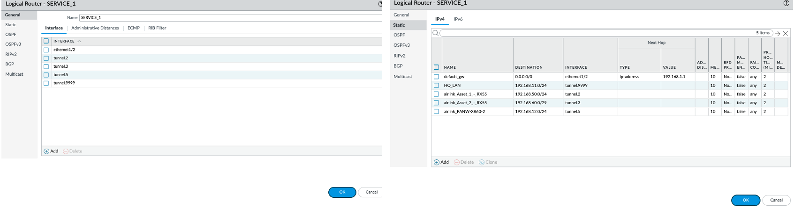

Note: On the remote end, Airlinks will automatically add the needed
route to the Service_1 network when operated in LAN mode.

#### Step 20: Test if IPSec tunnel comes up 

[<u>(back to overview table)</u>](#overall-workflow)

Airlinks in passive mode will try to connect to their IKE GW every
30seconds per default. If your test in Step 14 proves that the IKE
traffic was reaching your NGFW, then the Steps 14-18 should have enabled
the IPSec tunnel and show a green status after commit and at max 2-3
minutes. If the Test in Step 14 was successful and this step is not,
then in most cases it is

- either an authentication related issue, e.g. with Certificate or
  Certificate Profile mismatch

- or a issue related to mismatches with the proxy selectors, e.g. if
  defined networks are not available or no interface in those networks
  can be reached, IKE will succeed but no tunnel will come up.

- or a basic crypto problem like mismatching proposals

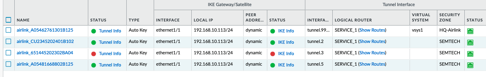

Once a tunnel is up, keep monitoring for at least 24hours to be sure it
will stay up. Consider adding DPD for later project phases.

#### 

#### NOTE: In case your tunnel does NOT come up, or shows different stages on Airlink and NGFW, refer to the troubleshooting section “[<u>Airlink Local Firewall Rules</u>](#airlink-local-firewall-rules)”\

#### Step 21: Define NGFW Security Policy 

[<u>(back to overview table)</u>](#overall-workflow)

If your IPSec tunnel is coming up and routing between the local network
and the Airlink is working, define Security Policies. We have enabled
the following directives now:

- Airlinks can be assigned to security zones by assigning the tunnel.X
  interface of the corresponding Airlink. Hence you can have each
  airlink in an own zone, group them or join all Airlinks into one
  commonn Zone

- Services LR can be one or multiple Zones. They are assigned by the
  physical interfaces on the DC side (ethernet1/2)

- The underlay LR is a separate zone in which only IKE and encapsulated
  IPSec traffic is allowed.

Below is an example policy. We can use solution approaches like XSOAR or
OneLayer to update the NGFW via Radius with IMSI-to-IP mappings, hence
the correlation rule (rule 2)

Note, that we allow traffic into 2 directions, from the Airlink to the
DC,, and also from the DC to the Airlink local LAN. For example DNP3
works usually “the other way around” and has the server in the field and
the client in the DC; while modbus traffic in the below example reaches
from a client in the field to a server in the DC.

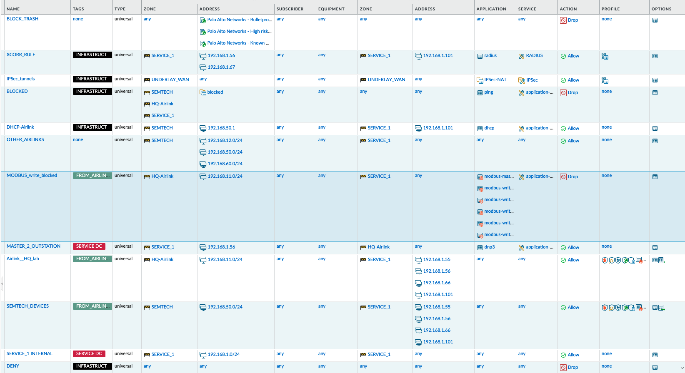

# Partner Product Configuration

Configuring the Airlink Routers is straightforward. For bulk
provisioning, we point to a procedure based on Templates and Workflows,
which is out of scope of this basic guide. Below section describes in
general, what settings need to be made on a single Airlink GUI to have
it connect to the NGFW via IPSec.

#### How to connect to the Airlink router

You can access Airlink routers configuration GUI from their local port
(default IP 192.168.1.1) or via ALMS. Once registered in ALMS, you only
need to power-on the router and connect it to the Internet (SIM card or
ISP link), then access it from your ALMS account.

If the Airlink has never been used, following documentation will help to
get it connected and registered in ALMS:

1)  Airlink QuickStart Guide,
    [<u>here</u>](https://source.sierrawireless.com/resources/airlink/hardware_reference_docs/airlink-xr60----qsg/#sthash.Ajy5qpLb.dpbs).

2)  AirlinkOS documentation,
    [<u>here</u>](https://source.sierrawireless.com/airlinkos/).

3)  ALMS register Guide,
    [<u>here</u>](https://source.sierrawireless.com/airvantage/almsc/howto/gettingstarted/).

To reach the registered and powered-on Airlink from ALMS, log in to your
ALSM account. Then click "**Monitor”-\> “Systems”** on the top trim, in
the next screen then select your system from the list of registered
systems in your account

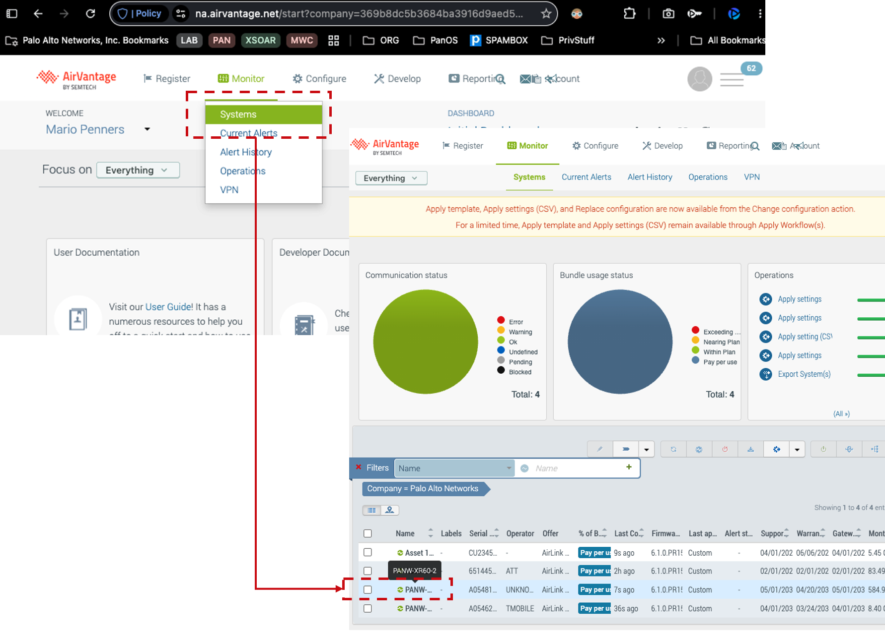

Once you have selected your system, choose “Configuration”on the system
page, in the second trim! This will render the Airlink GUI into your
current browser. Configuration functions are available here in the same
way as in the local GUI, logs are local only.

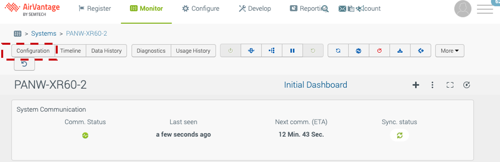

#### 

#### Step 9: Upload CA Certs to Airlink 

When logged in to the Airlink main configuration GUI, click from the
left side main menu **“System”-\> “Security”-\> “Certificates”**

Below Screenshot shows a fully populated GUI with all EST settings
already made. To get there, start in the uppermost section **”Imported
Certificates**” and press the “**Upload Certificate**” button.

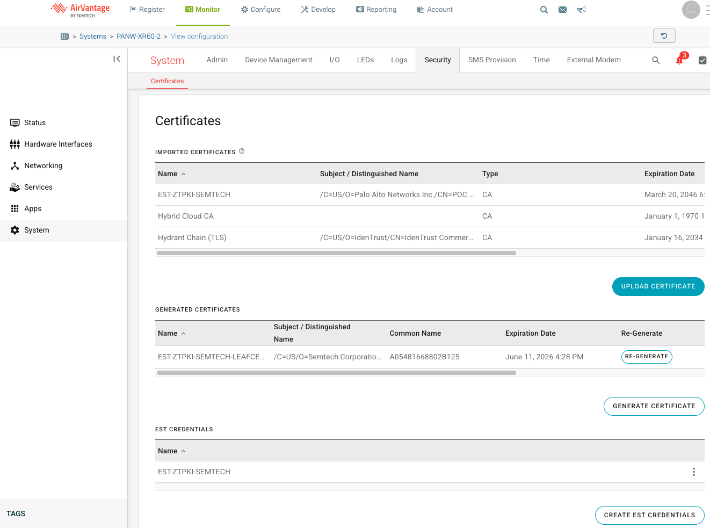

The popup window changes to below shape when you set the “Type” line to
‘Root certificate”.

> **Action 1:** Now assign a Name for the TLS Certificate and upload the
> Chain we downloaded in Step 4, click create and save
>
> **Action 2:** Repeat the same flow to upload the EST CA Certificate
> chain we obtained in Step 3, click create and save

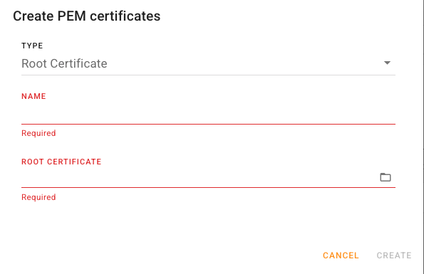

When you are done with this Step, you will have 3 CA certificate(s)
chains, the 2 you created, plus a default “Hybrid Cloud” CA that had
already been there before. Mind the status must be “valid” or your file
is not accepted. It can take a few seconds before it is recognised.

#### Step 10: Configure Airlink EST Credentials

EST Credentials are used during Certificate enrollment, to authenticate
your Airlink as a legitimate client who may obtain a certificate. You
store the credentials and later refer to them when the actual
Certificate Signing request is made and sent to the ZT-PKI.

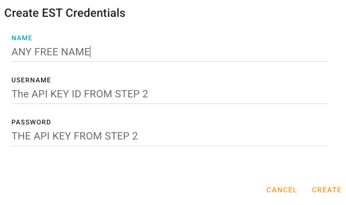

The credentials are obtained from the ZT-PKI as API key, in Step 2 of
this document. Enter them here and create and save.

NOTE: Once entered, the credentials are never shown in cleartext again.
To activate the “eyeball” icon, they have to be entered again first,
this also applies when thee credentials are stored in a template. The
idea is to prevent unauthorized access to it.

If you plan to later make this particular Airlink configuration a
Template, then do NOT use a credential-set NAME that includes the serial
number or information that is specific to only this router!

#### Step 11: Configure Airlink CSR

The actual CSR is configured in the central section “Generated
Certificates”, press on “Generate Certificate” to define how your EST
request will be made. In the window that will be popping up, following
settings are possible or required:

<table style="width:100%;">
<colgroup>
<col style="width: 38%" />
<col style="width: 46%" />
<col style="width: 14%" />
</colgroup>
<tbody>
<tr>
<td style="text-align: left;"><strong>Setting Name</strong></td>
<td style="text-align: left;"><strong>Meaning / value</strong></td>
<td style="text-align: left;"><strong>required</strong></td>
</tr>
<tr>
<td style="text-align: left;">Name</td>
<td style="text-align: left;">
Any name for the certificate
to-be-requested here

If the certificate is granted, you will be referring to it under this
name in the IPSec tunnel definition.
</td>
<td style="text-align: left;">YES</td>
</tr>
<tr>
<td style="text-align: left;">Key Algorithm</td>
<td style="text-align: left;">RSA is best for compatibility (PQC to be
discussed apart)</td>
<td style="text-align: left;">YES</td>
</tr>
<tr>
<td style="text-align: left;">Key Size</td>
<td style="text-align: left;">Default 2028 is sufficient. Longer
certificate validity should have longer keys, also has more
compatibility constraints</td>
<td style="text-align: left;">YES</td>
</tr>
<tr>
<td style="text-align: left;">Ues Device Serial Number for Common
Name</td>
<td style="text-align: left;">Always put this to “Yes”</td>
<td style="text-align: left;">YES</td>
</tr>
<tr>
<td style="text-align: left;">Common Name</td>
<td style="text-align: left;">This is pre-set by above line and must be
the serial number</td>
<td style="text-align: left;">YES</td>
</tr>
<tr>
<td style="text-align: left;">email</td>
<td rowspan="6" style="text-align: left;">
X.509 directory parameters
to identify a “leaf” .

Those parameters are all optional, you can pre-fill it but depending
on policy the CA might overwrite it or deny your request if the values
contradict what is prepopulated in the policy. Mind, that you are filing
a request rather than defining the final certificate !
</td>
<td rowspan="6" style="text-align: left;">NO</td>
</tr>
<tr>
<td style="text-align: left;">Country</td>
</tr>
<tr>
<td style="text-align: left;">State</td>
</tr>
<tr>
<td style="text-align: left;">Locality</td>
</tr>
<tr>
<td style="text-align: left;">Organization</td>
</tr>
<tr>
<td style="text-align: left;">Organization Unit</td>
</tr>
<tr>
<td style="text-align: left;">Subject Alternate Name</td>
<td style="text-align: left;">
DNS:[this-airlink-serialnumber]

It has to be in this format and it has to be exactly the serial
number, or IPSec wont work. Example:

DNS: A05481668802B125
</td>
<td style="text-align: left;">YES</td>
</tr>
<tr>
<td style="text-align: left;">CMS URL</td>
<td style="text-align: left;">
Base URL of the ZT PKI

https://ztpki.venafi.com
</td>
<td style="text-align: left;">YES</td>
</tr>
<tr>
<td style="text-align: left;">CMS re-enroll URL</td>
<td style="text-align: left;">
This is standardised and must be:

<a
href="about:blank"><u>https://[CA-Label].est.ztpki.venafi.com</u></a>

I.e. you insert the CA label before the path starting .est. …,
e.g.

https://fe167ad9-3a76994ccd68160a.est.ztpki.venafi.com
</td>
<td style="text-align: left;">YES</td>
</tr>
<tr>
<td style="text-align: left;">CA Label</td>
<td style="text-align: left;">The policy ID as obtained in Step 1</td>
<td style="text-align: left;">YES</td>
</tr>
<tr>
<td style="text-align: left;">Re-enroll label</td>
<td style="text-align: left;">Normally this is empty (project specific
differences possible)</td>
<td style="text-align: left;">NO</td>
</tr>
<tr>
<td style="text-align: left;">CMS Root CA Certificate</td>
<td style="text-align: left;">The TLS CA Chain (Hydrant Chain) from step
4, uploaded here in step 9 action 1</td>
<td style="text-align: left;">YES</td>
</tr>
<tr>
<td style="text-align: left;">CMS Rot CA Credentials</td>
<td style="text-align: left;">The credential set we stored in step 10
(API Key)</td>
<td style="text-align: left;">YES</td>
</tr>
<tr>
<td style="text-align: left;">Cert-Auth Enroll after Basic</td>
<td style="text-align: left;">Enable this. It is a RFC compliant
mechanism to use the existing cert instead of the API key when
re-enrolling for a new cert (after initial was issued once)</td>
<td style="text-align: left;">YES</td>
</tr>
</tbody>
</table>

After you have made all settings and saved the "Generate Certificate”
CSR, you can see on the right side of the section that the Airlink is
now starting the enrollment process. After not more than 30seconds you
should have a status “Valid” and see a certificate (i.e. Validity Date
and Subject Name columns are now populated) . If your status is “valid”
try also the Re-Enroll button and watch the actions, you must obtain a
valid certificate again. The Re-Enrollment is needed to automatically
obtain new certificates when existing ones are about to expire.

If you plan to later make this particular Airlink configuration a
Template, then do NOT use a parameter-set NAME that includes the serial
number or information that is specific to only this router!

#### Step 12: Configure Airlink Local Networks

When defining the IPSec Client settings, we must define which local
network segment should be routed into the tunnel. This setting is needed
on both ends, on the NGHFW side (as remote network) and on the Airlink
(as local network) .

Airlink routers have a default LAN Segment and additional Network
Objects that can be created, similar to PanOS Address Objects.

**Action 1:** To change the default Lan Segment, click in the left side
main menu to **"Networking” -\> “Zone Settings” -\> “Lan Segments”**
Edit the IP network to ensure there will not be accidental overlaps, and
assign a unique IP range to each Airlink. E.g. if your Airlinks have
only 2 LAN ports that you want to route upstream, a /29 network will do,
including a GW IP in the Airlink itself plus 2 clients.

**Action 2:** To add a local network Object, click to "Networking” -\>
“Zone Settings” -\> “Device / IP Network”, scroll to "Devices” and press
‘Create” ; Create an IP address Object that has the same IP network than
your default LAN (e.g. 192.168.11.0/24) . Once you enter a valid IP
Network address, the obligatory “Ethernet MAC Address” block will
disappear.

**Action 3:** Create another network Object like in Action 2, but
defining the Datacenter local network that is connected behind the NGFW.
You will need this entry for IPSec remote network definition and
automatic creation of routes via the tunnel

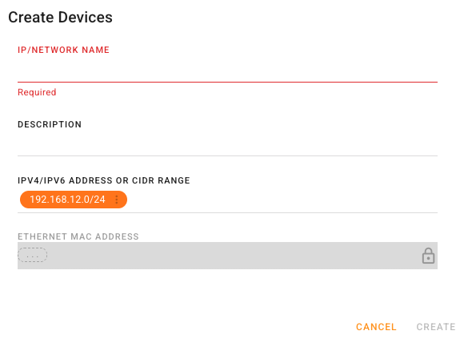

#### Step 12 optional: Configure DHCP-relay through the IPSec tunnel

We have used the Default LAN as local network Object and will use it as
IPSec local network. If you do not want the Airlink router itself to
assign the IP addresses inside this segment, you can also forward DHCP
requests through the IPSec tunnel. For this you need to define a DHCP
server on the NGFW or behind it, and set the IP address of this DHCP
server here in the DHCP Relay settings of the Default LAN Segment.

Note, that extending the Layer 2 via the tunnel into the NGFW is a major
design knob and that it enables IoT subscription to natively see the
DHCP traffic, hence recognize and classify the individual devices behind
the FW.

#### Step 13: Configure Airlink IPSec 

IPSec client functionality is only defined in one central place at the
Airlink routers. Open from the left side main menu the item
**“Networking” -\> “VPN” -\> “IPsec Tunnels”** . You can have multiple
VPNs on the Airlink and theoretically both could be active
simultaneously. Practically, this would rather lead to routing issues
unless your specific situation caters for it. We have tested
Active-Standby situations where you can disable one VPN and enable the
other, which works flawless. In that setup, the same local LAN is routed
through the active VPN to different destination networks. However,
default routes could be problematic/ambiguous.

Define a single IPSec tunnel between your local LAN and the remote
Datacenter LAN: Following parameters are available and optional or
required when pressing “Create IPSec Tunnel”

<table>
<colgroup>
<col style="width: 26%" />
<col style="width: 55%" />
<col style="width: 18%" />
</colgroup>
<tbody>
<tr>
<td><strong>Setting Name</strong></td>
<td><strong>Meaning / value</strong></td>
<td><strong>required</strong></td>
</tr>
<tr>
<td>Name</td>
<td style="text-align: left;">Name by which it will be VPN Parameter set
will be visible later</td>
<td style="text-align: left;">Yes</td>
</tr>
<tr>
<td>Mode</td>
<td style="text-align: left;">Set to Client, means the active
reaching-out side for IKE</td>
<td style="text-align: left;">Yes</td>
</tr>
<tr>
<td>LAN / HOST Mode</td>
<td style="text-align: left;">LAN Mode, encapsulate and route traffic
from local segments</td>
<td style="text-align: left;">Yes</td>
</tr>
<tr>
<td>Rank</td>
<td style="text-align: left;">Use 1, also with 2 VPNs do not change</td>
<td style="text-align: left;">Yes</td>
</tr>
<tr>
<td>IKE Version</td>
<td style="text-align: left;">We use only IKEv2. Must match NGFW IKE
Crypto Profile.</td>
<td style="text-align: left;">Must match NGFW</td>
</tr>
<tr>
<td>Multiple SAs for IKE</td>
<td style="text-align: left;">Multiple IPSec tunnels can be built to the
same IKE peer, this is needed when using multiple subnets to route to or
inside the tunnel</td>
<td style="text-align: left;">Usually no/off</td>
</tr>
<tr>
<td>MOBIKE</td>
<td style="text-align: left;">Mobile IKE, for driving vehicles allowing
IP-address change during an IKE exchange. Enable depending on use
case</td>
<td style="text-align: left;">Usually no/off</td>
</tr>
<tr>
<td>UDP Encapsulation</td>
<td style="text-align: left;">You can leave on Auto, it is usually used,
never seen TCP for IPSec.</td>
<td style="text-align: left;">No</td>
</tr>
<tr>
<td>Authentication Type</td>
<td style="text-align: left;">Certificate ; Use PSK only for testing -
it doesn’t scale in production</td>
<td style="text-align: left;">Yes</td>
</tr>
<tr>
<td>Certificate</td>
<td style="text-align: left;">The EST Certificate Name we created in
Step 11</td>
<td style="text-align: left;">Yes</td>
</tr>
<tr>
<td>Peers</td>
<td style="text-align: left;">The Public IP or related FQDN that the
NGFW exposes to receive the IKE/IPSec traffic. Only this peer needs to
be defined, the Airlink local IP can be “anything” and is not relevant
for our setup.</td>
<td style="text-align: left;">Yes</td>
</tr>
<tr>
<td>Local Subnets</td>
<td style="text-align: left;">The local Network Segment defined in Step
12 actions 1 and 2</td>
<td style="text-align: left;">Yes</td>
</tr>
<tr>
<td>Remote Subnets</td>
<td style="text-align: left;">The remote network in the DC defined in
Step 12 action 3</td>
<td style="text-align: left;">Yes</td>
</tr>
<tr>
<td>Exempt Subnets</td>
<td style="text-align: left;">Not needed ; Iocal subnets that explicitly
must not go into the tunnel</td>
<td style="text-align: left;">No</td>
</tr>
<tr>
<td>Local Authentication ID</td>
<td style="text-align: left;">The SAN DNS:[Serialnumber] from the
Certificate (Step 11)</td>
<td style="text-align: left;">Yes</td>
</tr>
<tr>
<td>Remote Authentication ID</td>
<td>The SAN DNS:[FW-host/name] from Step 6 (NGFW Certificate)</td>
<td>Yes</td>
</tr>
<tr>
<td>WAN Interfaces</td>
<td>Set to Cellular unless you use different uplink</td>
<td>Yes</td>
</tr>
<tr>
<td>Dead Peer Detection (DPD)</td>
<td rowspan="2">DPD parameters are ineffective in our setup since we do
not have it fully configured on the NGFW. Using DPD would require
setting an IP-address to the NGFW tunnel interfaces.</td>
<td>No</td>
</tr>
<tr>
<td>DPD Interval (Seconds)</td>
<td>No</td>
</tr>
<tr>
<td>IKE Rekey Time (Seconds)</td>
<td>7200, must start re-keying before keys expire on NGFW (passive
mode)</td>
<td>Must match NGFW</td>
</tr>
<tr>
<td>IKE Encryption</td>
<td>AES256 for easy compatibility (PQC to be discussed separately)</td>
<td>Must match NGFW</td>
</tr>
<tr>
<td>IKE Integrity</td>
<td>AES256 for easy compatibility (PQC to be discussed separately)</td>
<td>Must match NGFW</td>
</tr>
<tr>
<td>IKE Diffie Hellman Groups</td>
<td>DH16, different default in PanOS!</td>
<td>Must match NGFW</td>
</tr>
<tr>
<td>Perfect Forward Security (PFS)</td>
<td>Leave at enabled ; It is optional for IKE and requires one
additional DH exchange within Phase 2, offers protection against later
key compromises (but not PQC!)</td>
<td>Supported per default in the NGFW</td>
</tr>
<tr>
<td>ESP Rekey Timer (Seconds)</td>
<td>7200, must start re-keying before keys expire on NGFW (passive
mode)</td>
<td>Must match NGFW</td>
</tr>
<tr>
<td>ESP Encryption</td>
<td>AES256 for easy compatibility (PQC to be discussed separately)</td>
<td>Must match NGFW</td>
</tr>
<tr>
<td>ESP Integrity</td>
<td>AES256 for easy compatibility (PQC to be discussed separately)</td>
<td>Must match NGFW</td>
</tr>
<tr>
<td>ESP Diffie-Hellman Groups</td>
<td>DH16, different default in PanOS</td>
<td>Must match NGFW</td>
</tr>
<tr>
<td>VPN Link Monitors</td>
<td>Currently not used in our config (leave empty)</td>
<td></td>
</tr>
</tbody>
</table>

After all settings are in, press ‘Create” and “Save”; At this point the
Airlink should start trying to reach the NGFW configured under “PEERS” ;
Before continuing with the NGFW IKE/IPSec configuration, verify tha
tthose requests are coming into the FW.

If you have local access to the Airlink, also check the log and monitor
the status messages on the “Create VPN” button: Expected messages are
“no SA found” or other crypto/authentication errors until the NGHFW is
fully configured. If you see errors related to local Interfaces or can
not ping the remote peer, ytou might have a transport/routing issue to
solve before continuing.

After defining the IPSec tunnel with local and remote networks (or
corresponding PRoxy Selectors in the Palo Alto IPSec tunnel
configuration ([<u>Step 18</u>](#step-18-configure-ipsec-tunnel)) ,
ensure you have no Firewall rule created by AIrlink OS that will block
your tunnel traffic (see Troubleshooting Section
[<u>here</u>](#airlink-local-firewall-rules))

\
=

# 

# Troubleshooting

## NOTE: *Use cases that do not match the use case(s) as documented in this integration guide, using a version of PAN-OS or a version of the partner product not listed as tested and validated are out of the scope of the integration as documented by this integration guide. Any additional use cases or variation from those use cases documented in this integration guide are out of the scope of this integration guide document. It is not outside the realm of possibility that unanticipated issues (i.e. scalability, concurrent API session limits, interoperability, other incompatibilities, etc.) could be encountered if out-of-scope use cases for this integration guide document are deployed. Therefore, after familiarizing yourself with the use cases documented in this integration guide, if there are plans to deploy use cases that are out-of-scope for this integration guide, it is highly recommended that the initial deployment be performed in a pilot/proof-of-concept environment prior to deployment within production.*

## 

## Common troubleshooting steps

#### Check IKE/IPSec connectivity from PanOS CLI

##### Checking IKE logs 

This is your bread and butter :

enable debug **debug ike global on debug**

enable full dump **debug ike global on dump**

disable debug **debug ike global off**

view logs **less mp-log ikemgr-ng.log**

**tail follow yes mp-log ikemgr-ng.log**

##### Check if there is an active IKE SA 

admin@CORE-FW\> show vpn ike-sa 

There is no IKEv1 phase-1 SA found.

There is no IKEv1 phase-2 SA found.

There is no IKEv2 SA found.

admin@CORE-FW\> show vpn ipsec-sa

There is no IPSec SA found.

admin@CORE-FW\>

### 

⇒ Instead of above you wanted to see an active SA and tunnel  

##### Clear hanging IKE SAs and IPSec tunnels even if not currently visible

admin@CORE-FW\> clear vpn ike-sa gateway 

  IKE-PRISMA   IKE-PRISMA

  \<value\>      clear for given IKE gateway

admin@CORE-FW\> clear vpn ike-sa gateway IKE-PRISMA 

IKE SA for gateway ID 1 not found.

admin@CORE-FW\> show vpn ike-sa

There is no IKEv1 phase-1 SA found.

There is no IKEv1 phase-2 SA found.

There is no IKEv2 SA found.

admin@CORE-FW\> clear vpn ipsec-sa tunnel 

  WSTPRISMA   WSTPRISMA

  \<value\>     clear for given VPN tunnel

admin@CORE-FW\> clear vpn ipsec-sa tunnel WSTPRISMA 

IPSec SA for tunnel WSTPRISMA not found.

admin@CORE-FW\> 

##### Restart the IKE SA (force re-negotiation)

admin@CORE-FW\> test vpn ike-sa gateway IKE-PRISMA 

Start time: Mar.11 12:05:54

Initiate 1 IKE SA.

admin@CORE-FW\>

NOTE: If you have set passive mode in IKE GW, you will not start a
negotiation and only can respond to it ! Also your entire IKE GW setup
and routing must allow you to actually start a negotiation (commonly
peer is “dynamic” so you won’t even know where to send a request)

##### Collecting VPN Config

Collect all configuration settings for a given IKE GW and related
routing

\#!/usr/bin/bash

\#put the names of your own object instances here

: "\${IKE_GW_NAME:=IKE-PRISMA}"

: "\${IKE_CRYPTO_PROFILE_NAME:=IKE-PRISMA}"

: "\${IPSEC_TUNNEL_NAME:=WSTPRISMA}"

: "\${IPSEC_CRYPTO_PROFILE_NAME:=IPSEC_PRISMA}"

: "\${TUNNEL_INTERFACE:=tunnel.1}"

: "\${TUNNEL_INTERFACE_ZONE:=PRA-TUNNEL}"

: "\${TUNNEL_ZONE_LR:=CORE_2_INTERNET}"

: "\${DEVICE_NAME:=localhost.localdomain}"

: "\${VSYS:=vsys1}"

\# now collect the xpath values

while read XPATH; do

    echo "show config running xpath \$XPATH"

done \<\<EOXPATH

devices/entry\[@name=\\\${DEVICE_NAME}\\\]/network/ike/gateway/entry\[@name=\\\${IKE_GW_NAME}\\\]

devices/entry\[@name=\\\${DEVICE_NAME}\\\]/network/ike/crypto-profiles/ike-crypto-profiles/entry\[@name=\\\${IKE_CRYPTO_NAME}\\\]

devices/entry\[@name=\\\${DEVICE_NAME}\\\]/network/tunnel/ipsec/entry\[@name=\\\${IPSEC_TUNNEL_NAME}\\\]

devices/entry\[@name=\\\${DEVICE_NAME}\\\]/network/ike/crypto-profiles/ipsec-crypto-profiles/entry\[@name=\\\${IPSEC_CRYPTO_NAME}\\\]

devices/entry\[@name=\\\${DEVICE_NAME}\\\]/network/interface/tunnel/units/entry\[@name=\\\${TUNNEL_INTERFACE}\\\]

devices/entry\[@name=\\\${DEVICE_NAME}\\\]/vsys/entry\[@name=\\\${VSYS}\\\]/zone/entry\[@name=\\\${TUNNEL_INTERFACE_ZONE}\\\]

devices/entry\[@name=\\\${DEVICE_NAME}\\\]/network/logical-router/entry\[@name=\\\${TUNNEL_ZONE_LR}\\\]/vrf/default/routing-table/ip/static-route

devices/entry\[@name=\\\${DEVICE_NAME}\\\]/vsys/\${VSYS}/rulebase/security/rules

devices/entry\[@name=\\\${DEVICE_NAME}\\\]/vsys/\${VSYS}/rulebase/nat/rules

devices/entry\[@name=\\\${DEVICE_NAME}\\\]/vsys/\${VSYS}/rulebase/pbf/rules

EOXPATH

##### Show working IPSec status output sample

admin@CORE-FW\> show vpn ike-sa detail gateway 

  IKE-PRISMA   IKE-PRISMA

  \<value\>      Show for given IKE gateway

admin@CORE-FW\> show vpn ike-sa detail gateway IKE-PRISMA 

IKE Gateway IKE-PRISMA, ID 1 192.168.1.10 =\> 144.125.90.106

  Current time: Mar.11 12:17:42

IKE SA:

  SPI:  57D57B99A1063996:B53D13349D134568  Init

        State:      Established

        SN:         1

        Authentication:  PSK, peer PSK

        Proposal:   AES256-CBC/SHA256/DH14

        ID local:   fqdn:mpelab.duckdns.org

           remote:  ipaddr:144.125.90.106

        ID_i:       FQDN:mpelab.duckdns.org

        ID_r:       IPv4_address:144.125.90.106

        NAT:        ME 

        Message ID: rx 0, tx 142

        Liveness check: sending informational packet after idle 5
seconds

        Created:    Mar.11 12:06:00, 11 minutes 43 seconds ago

        Expires:    Mar.11 20:06:00, rekey in 6 hours 24 minutes 53
seconds (23796 sec)

  Child SA 1:

        Tunnel 1    WSTPRISMA

        Type:       ESP       Init

        State:      Mature

        Message ID: 00000001

        Parent SN:  1

        SPI:        DC741738 : 834DBC59 

        Algorithm:  AES256-CBC/SHA256/DH14

        TS local:   Proto:any, 0.0.0.0-255.255.255.255, Ports:any

        TS remote:  Proto:any, 0.0.0.0-255.255.255.255, Ports:any

        Created:    Mar.11 12:06:00, 11 minutes 43 seconds ago

        Expires:    Mar.11 13:06:00, rekey in 36 minutes 28 seconds
(2891 sec)

  Child SA 141:

        Type:       INFO

        State:      Expired

        Message ID: 0000008D

        Parent SN:  1

admin@CORE-FW\>

admin@CORE-FW\> show vpn ipsec-sa summary

Total 1 tunnels found. 1 ipsec sa found.

##### \

##### AIrlink local Firewall rules

Ensure that your Airlink is not blo cking traffic that arrives through
the IPSec tunnel. We noticed in AirlinkOS version 6.1 a behaviour that
when you create the Objects for local and remote networks in the IPSec
config of the Airlink ([<u>Step
13</u>](#step-13-configure-airlink-ipsec)), a blocking rule in
Networking -\> Firewall Rules -\> System Firewall Rules might be
silently created

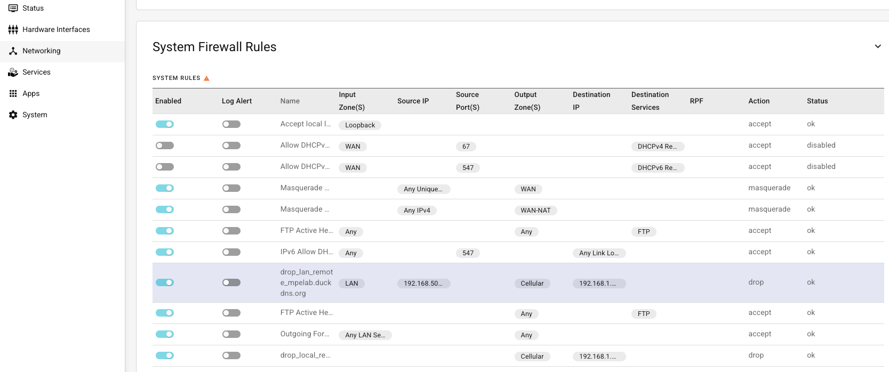

If a rule is enabled that blocks traffic for which Palo Alto NGFW has a
Proxy Selector on tha tIPSec tunnel, then

- No traffic will pass through the tunnel

- Your IKE will work perfect but

- IPSec tunnel will remain status “red” in the NGFW GUI

- Airlink will show a tunnel as “Connected”

=\> If you find this situation, check the Airlink Firewall rules and as
second step the NGFW routing into the tunnel interface

#### Openssl CLI on Linux

### 

You can use the openssl command shell from your regular MacOS/linux CLI
to do basically anything around certificates and TLS/SSL itself.

### 

##### Generate keypair and CSR 

total 0

0 drwxr-xr-x 2 mpenners staff 64 Mar 27 07:52 .

0 drwxr-xr-x@ 11 mpenners staff 352 Mar 27 07:52 ..

\[07:53:01\]\[mpenners@M-N4MH2PC4VV\]\[TESTA\]# **openssl req -new
-newkey rsa:2048 -nodes -keyout ./device.key -out ./device.csr -subj
"/CN=CU23452024104"**

......+.+++++++++++++++++++++++++++++++++++++++\*....+++++++++++++++++++++++++++++++++++++++\*.+...+.+..............+......+....+.....+..........+..+....+.....+.............+............+........+.+.....+....

-----

\[07:53:06\]\[mpenners@M-N4MH2PC4VV\]# ll

total 16

0 drwxr-xr-x@ 11 mpenners staff 352 Mar 27 07:52 ..

8 -rw-------@ 1 mpenners staff 1708 Mar 27 07:53 device.key

0 drwxr-xr-x@ 4 mpenners staff 128 Mar 27 07:53 .

8 -rw-r--r--@ 1 mpenners staff 895 Mar 27 07:53 device.csr

\[07:53:08\]\[mpenners@M-N4MH2PC4VV\] \#

###  

The simple CSR created above is a default signing request for a
“subject” called CU23452024104 (which could be an Airlink serial number)
. However, X.509 certificates have a customizable structure in regards
to :

> \- Standardized fields they may contain to define the certified
> information (e.g. if an IP-address, FQDN or email address is to be
> certified requires to have the corresponding info specified in a
> correct field) (Subject Alternate Name Fields)
>
> \- Meta information about how the certificate can be used, e.g. if it
> can identify only a user or a server, if it can be used for code
> signing or only for email signing or for both (key usage constraints)

To build a certificate that fits our purpose, the request must be
structured. Create a basic config file for that. The openssl command
will accept it without additional parsing if you specify the following
format:

\# cat airlink_ike.cnf

\[ req \]

default_bits = 2048

default_md = sha256

prompt = no

distinguished_name = dn

req_extensions = req_ext

\[ dn \]

CN = CU2345202401B102

\[ req_ext \]

basicConstraints = CA:FALSE

keyUsage = critical, digitalSignature, keyEncipherment

extendedKeyUsage = clientAuth, serverAuth

subjectAltName = @alt_names

\[ alt_names \]

DNS.1 = CU2345202401B102

###  

##### \

##### Generating CSR from config file

Now run openssl to generate the proper request (csr file):

\[09:09:28\]\[mpenners@M-N4MH2PC4VV\]\[TESTA\]# openssl req -new -newkey
rsa:2048 -nodes -keyout airlink.key -out airlink.csr -config airlink.cnf

.....+.............+..+.......+...+++++++++++++++++++++++++++++++++++++++\*.+......+...+......+.+...+

.+...+.................+.+........+.+.........+.....+....+...........+.+......++++++

-----

\[09:10:49\]\[mpenners@M-N4MH2PC4VV\]\[TESTA\]# ll

total 24

0 drwxr-xr-x@ 11 mpenners staff 352 Mar 27 07:53 ..

8 -rw-r--r--@ 1 mpenners staff 381 Mar 27 09:09 airlink.cnf

8 -rw-------@ 1 mpenners staff 1704 Mar 27 09:10 airlink.key

0 drwxr-xr-x@ 5 mpenners staff 160 Mar 27 09:10 .

8 -rw-r--r--@ 1 mpenners staff 1041 Mar 27 09:10 airlink.csr

\[09:10:53\]\[mpenners@M-N4MH2PC4VV\]\[TESTA\]#

##### **X509 cert file formats**

Certificates or Certificate signing requests are exchanged in a variety
of formats, permuattions mostly created by:

> \- Encoding: the information can be binary- or base64 ascii formatted
>
> \- the private key belonging to the certificate can be packaged into
> the same envelope along with the certified/signed information of the
> key holder, or it can be kept separate
>
> \- since every end-device / leaf certificate requires a CA certificate
> to verify it, leaf certificates can be kept isolated or along with the
> chain of CA-certificates needed to verify them

Following file formats are common

<table style="width:95%;">
<colgroup>
<col style="width: 9%" />
<col style="width: 85%" />
</colgroup>
<tbody>
<tr>
<td>.csr</td>
<td>Certificate Signing Request. Contains public key + subject +
extensions. Sent to CA for signing and not a certificate; usually base64
ascii encoded</td>
</tr>
<tr>
<td>.crt .pem</td>
<td>Base64-encoded container (ASCII). Can hold cert, key, or chain. Uses
-----BEGIN ...-----. Very flexible, widely used, you can just
cut&amp;paste the complete info no file-copy needed</td>
</tr>
<tr>
<td>.der</td>
<td>
Binary (ASN.1 DER) encoded certificate or key. Same data as PEM
but not base64 encoded; sometimes .pem/crt files contain .der binary
data – minor confusion that can be resolved with conversion :

<strong>openssl x509 -inform DER -in cert.der -out
cert.pem</strong>
</td>
</tr>
<tr>
<td>
.p7b

.p7c
</td>
<td>PKCS#7 container. Holds certificate chain only, no private key.
Common in Windows environments</td>
</tr>
<tr>
<td>
.p12

.pfx
</td>
<td>PKCS#12 container. Holds private key + certificate + chain in one
file, password-protected.</td>
</tr>
<tr>
<td>.p8</td>
<td>PKCS#8 private key format. Can be encrypted or unencrypted, quite
modern and not yet very common envelope format</td>
</tr>
</tbody>
</table>

The csr created in the previous step os a regular ASCII format and the
key is in a separate file. The signed csr (i.e. the certificate) needs
to remain together with this private key or its useless, and whoever
controls the key controls the identity of the certificate subject and
can impersonate it if the key is compromised/stolen. Hence handling
certificates offline turns into a logistics and security-process issue
rather than a technical challenge.

Use openssl Cli to chain CA certificates (echo CA1.pem CA2.pem \>
CAchain.pem ), to convert between formats or to just display certificate
content, e.g.

###  

**\[09:35:26\]\[mpenners@M-N4MH2PC4VV\]\[TESTA\]# cat airlink.csr**

-----BEGIN CERTIFICATE REQUEST-----

MIICyDCCAbACAQAwGzEZMBcGA1UEAwwQQ1UyMzQ1MjAyNDAxQjEwMjCCASIwDQYJ

KoZIhvcNAQEBBQADggEPADCCAQoCggEBALOJYggFSwkVns7pZ4c9m1alZS83vlKG

8O/taH5Io9AXKeZThLTaKIFrzWKZ2ek7J1zf5wumZArYs08Z5uTIf+61feyxiiDc

Xn7tyyvWedJFzVElrDIQwRg9Lpnb563ZM2bnLBPRe7UNsy0A45WBHfxx3X583sZU

8O1pMM6dMOte26MXou00qlETq0kgICfCxylzjWKaA0hACkN+mxIcapLZR6Pkne/k

UqjNZkER5DrzRtel8vXYVlM9hDzHskN6E3adV1hosgdT4BJKkJF9Ti15lwg+ADKx

aDk1yOkyrksDDehzHhS+wQ0+hroduM2B095nLJJREpzLTUeIPRjH0XUCAwEAAaBo

MGYGCSqGSIb3DQEJDjFZMFcwCQYDVR0TBAIwADAOBgNVHQ8BAf8EBAMCBaAwHQYD

VR0lBBYwFAYIKwYBBQUHAwIGCCsGAQUFBwMBMBsGA1UdEQQUMBKCEENVMjM0NTIw

MjQwMUIxMDIwDQYJKoZIhvcNAQELBQADggEBAE5wzKXg1/j6CxHd6YloYqEPfoLa

o3NmNmH/vn+jCi2+r81bJwiMzfln6BMXZx6fW+prpnALYrvkoW2h5TxK4cF5f3LX

3ie+HufSWuHYFXvMXTxXONQmravivUgOoXlvPyk9tCIt0Bueqvid0iejH6i/1HUt

5Iy7s7GL0qTcjJ9xcOPdk1+VhDi/zwg8HzjnNjFcdtk5xzZiYNV1xh3zIEMM+4lo

9j81CYQUkYxOAqnQ3F/UbsWx2kHdF4ZpqZ2yL+XiQ5R5GBQdwxKbUFMv+jcztuaq

h3lrjyKwjO8p+fxNjKn5NrZ53GBu1ssGE8OcrEP2FtWmlH7k76V6GNt4rDI=

-----END CERTIFICATE REQUEST-----

\[09:35:32\]\[mpenners@M-N4MH2PC4VV\]\[TESTA\]#

##### Display Request Content 

**\[09:35:16\]\[mpenners@M-N4MH2PC4VV\]\[TESTA\]# openssl req -in
airlink.csr -noout -text**

Certificate Request:

Data:

Version: 1 (0x0)

Subject: CN=CU2345202401B102

Subject Public Key Info:

Public Key Algorithm: rsaEncryption

Public-Key: (2048 bit)

Modulus:

00:b3:89:62:08:05:4b:09:15:9e:ce:e9:67:87:3d:

9b:56:a5:65:2f:37:be:52:86:f0:ef:ed:68:7e:48:

a3:d0:17:29:e6:53:84:b4:da:28:81:6b:cd:62:99:

d9:e9:3b:27:5c:df:e7:0b:a6:64:0a:d8:b3:4f:19:

e6:e4:c8:7f:ee:b5:7d:ec:b1:8a:20:dc:5e:7e:ed:

cb:2b:d6:79:d2:45:cd:51:25:ac:32:10:c1:18:3d:

2e:99:db:e7:ad:d9:33:66:e7:2c:13:d1:7b:b5:0d:

b3:2d:00:e3:95:81:1d:fc:71:dd:7e:7c:de:c6:54:

f0:ed:69:30:ce:9d:30:eb:5e:db:a3:17:a2:ed:34:

aa:51:13:ab:49:20:20:27:c2:c7:29:73:8d:62:9a:

03:48:40:0a:43:7e:9b:12:1c:6a:92:d9:47:a3:e4:

9d:ef:e4:52:a8:cd:66:41:11:e4:3a:f3:46:d7:a5:

f2:f5:d8:56:53:3d:84:3c:c7:b2:43:7a:13:76:9d:

57:58:68:b2:07:53:e0:12:4a:90:91:7d:4e:2d:79:

97:08:3e:00:32:b1:68:39:35:c8:e9:32:ae:4b:03:

0d:e8:73:1e:14:be:c1:0d:3e:86:ba:1d:b8:cd:81:

d3:de:67:2c:92:51:12:9c:cb:4d:47:88:3d:18:c7:

d1:75

Exponent: 65537 (0x10001)

Attributes:

Requested Extensions:

X509v3 Basic Constraints:

CA:FALSE

X509v3 Key Usage: critical

Digital Signature, Key Encipherment

X509v3 Extended Key Usage:

TLS Web Client Authentication, TLS Web Server Authentication

X509v3 Subject Alternative Name:

DNS:CU2345202401B102

Signature Algorithm: sha256WithRSAEncryption

Signature Value:

4e:70:cc:a5:e0:d7:f8:fa:0b:11:dd:e9:89:68:62:a1:0f:7e:

82:da:a3:73:66:36:61:ff:be:7f:a3:0a:2d:be:af:cd:5b:27:

08:8c:cd:f9:67:e8:13:17:67:1e:9f:5b:ea:6b:a6:70:0b:62:

bb:e4:a1:6d:a1:e5:3c:4a:e1:c1:79:7f:72:d7:de:27:be:1e:

e7:d2:5a:e1:d8:15:7b:cc:5d:3c:57:38:d4:26:ad:ab:e2:bd:

48:0e:a1:79:6f:3f:29:3d:b4:22:2d:d0:1b:9e:aa:f8:9d:d2:

27:a3:1f:a8:bf:d4:75:2d:e4:8c:bb:b3:b1:8b:d2:a4:dc:8c:

9f:71:70:e3:dd:93:5f:95:84:38:bf:cf:08:3c:1f:38:e7:36:

31:5c:76:d9:39:c7:36:62:60:d5:75:c6:1d:f3:20:43:0c:fb:

89:68:f6:3f:35:09:84:14:91:8c:4e:02:a9:d0:dc:5f:d4:6e:

c5:b1:da:41:dd:17:86:69:a9:9d:b2:2f:e5:e2:43:94:79:18:

14:1d:c3:12:9b:50:53:2f:fa:37:33:b6:e6:aa:87:79:6b:8f:

22:b0:8c:ef:29:f9:fc:4d:8c:a9:f9:36:b6:79:dc:60:6e:d6:

cb:06:13:c3:9c:ac:43:f6:16:d5:a6:94:7e:e4:ef:a5:7a:18:

db:78:ac:32

\[09:35:26\]\[mpenners@M-N4MH2PC4VV\]\[TESTA\]#

As an offline file and in the way as created above, the CSR could be
sent to any CA / Certificate Authority!

You can also have those requests signed in your assigned PKI if tehre is
a corresponding policy for manual enrollment.

\
-

# General Information :

#### Fragmentation and MTU/MSS issues

Mobile networks with several layers of tunnels can raise MTU and MSS
issues. Your central point of interest is the tunnel.x interface

##### Find the real path MTU

In the below example, approximate the path MTU between 1400 and 1300
byte

C:\Users\admin\Documents\OTDEMO\>ping 192.168.1.101 -f -l 1400

Pinging 192.168.1.101 with 1400 bytes of data:

Reply from 192.168.11.1: Packet needs to be fragmented but DF set.

Packet needs to be fragmented but DF set.

Packet needs to be fragmented but DF set.

Packet needs to be fragmented but DF set.

Ping statistics for 192.168.1.101:

Packets: Sent = 4, Received = 1, Lost = 3 (75% loss),

Ping statistics f

C:\Users\admin\Documents\OTDEMO\>ping 192.168.1.101 -f -l 1300

Pinging 192.168.1.101 with 1300 bytes of data:

Reply from 192.168.1.101: bytes=1300 time=275ms TTL=63

Reply from 192.168.1.101: bytes=1300 time=297ms TTL=63

Reply from 192.168.1.101: bytes=1300 time=385ms TTL=63

Ping statistics for 192.168.1.101:

Packets: Sent = 3, Received = 3, Lost = 0 (0% loss),

Approximate round trip times in milli-seconds:

Minimum = 275ms, Maximum = 385ms, Average = 319ms

Control-C

^C

C:\Users\admin\Documents\OTDEMO\>

On linux/MacOS :

Ping -D -s 1400 192.168.1.101

ICMP Payload + 28 = IP Packet Size

##### \

##### Calculate MSS and MTU 

Path MTU = successful ping payload size + 28Byte

MSS = MTU - 40

e.g.:

|                |         |
|:--------------:|:-------:|
| **Tunnel MTU** | **MSS** |
|      1500      |  1460   |
|      1400      |  1360   |
|      1360      |  1320   |
|      1315      |  1275   |

Leave physical Interface MTU on 1500, set tunnel interface MTU according
to above formula

Set MSS on tunnel interface

Contact Information for Support\
\
For \<Partner\> specific issues:\
=================================

- List partner support contact information here

# 

# 

# For Palo Alto Networks specific issues:

# 

- [<u>Palo Alto Networks Live
  Community</u>](https://www.paloaltonetworks.com/services/live-community)

- [<u>Palo Alto Networks Customer
  Support</u>](https://www.paloaltonetworks.com/company/contact-support)

\
=

# 

# Technical Details

- If applicable, list the names of API calls that are being leveraged to
  enable this integration. If none simply say so.

- If this is a syslog integration, list out the types of log(s) being
  used (traffic, threat, HIP Match, config, system, endpoint agent logs,
  etc.).

- List out any additional technical details on how the two technologies
  integrate.

- **For all WildFire Integrations:** If the partner’s integration logic
  executes actions to submit samples to WildFire, the technology partner
  must ensure that the integration logic performs a hash check prior to
  submitting the sample to WildFire so only files that are unknown to WF
  are uploaded.

- **For all WildFire Integrations:** Joint customers leveraging the
  integration must already have their own WildFire API key.**\**

- **For all WildFire Integrations:** The technology partner is required
  to implement capability to allow the end-customer a means to submit to
  them, a (Change Verdict Request Form). The (Change Verdict Request
  Form) will be filled out by the end-customer and the end-customer will
  describe the reason(s) why they object to the verdict returned by
  WildFire. The end-customer will provide applicable information such
  as: sample file name, hash value, sample file type, URL, etc.\
  The WildFire technology partner will verify that they have applicable
  information from the end-customer to file a WildFire support ticket
  with Palo Alto Networks (
  [<u>https://www.paloaltonetworks.com/company/contact-support</u>](https://www.paloaltonetworks.com/company/contact-support)
  ).

**Preparing the Integration Guide (IG) and Joint Solution Brief (JSB).
When your team begins to use the provided template(s) to prepare the
Integration Guide(IG) and Joint Solution Brief (JSB), in the section of
the template showing the generalized integration diagram, please ensure
that you depict the Palo Alto Networks ML-Powered NGFW and/or Panorama
(if applicable) using the approved iconology and the labeling below:**

Obviously it is ok to reduce the size of the icons and the font in order
to accommodate available space on the generalized integration diagram as
applicable. Only include Palo Alto Networks iconology that is part of
your integration. (**NOTE**: **Once the IG DRAFT is completed, this page
should be deleted**).

ML-Powered NGFW

Panorama

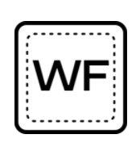

WildFire

GlobalProtect
